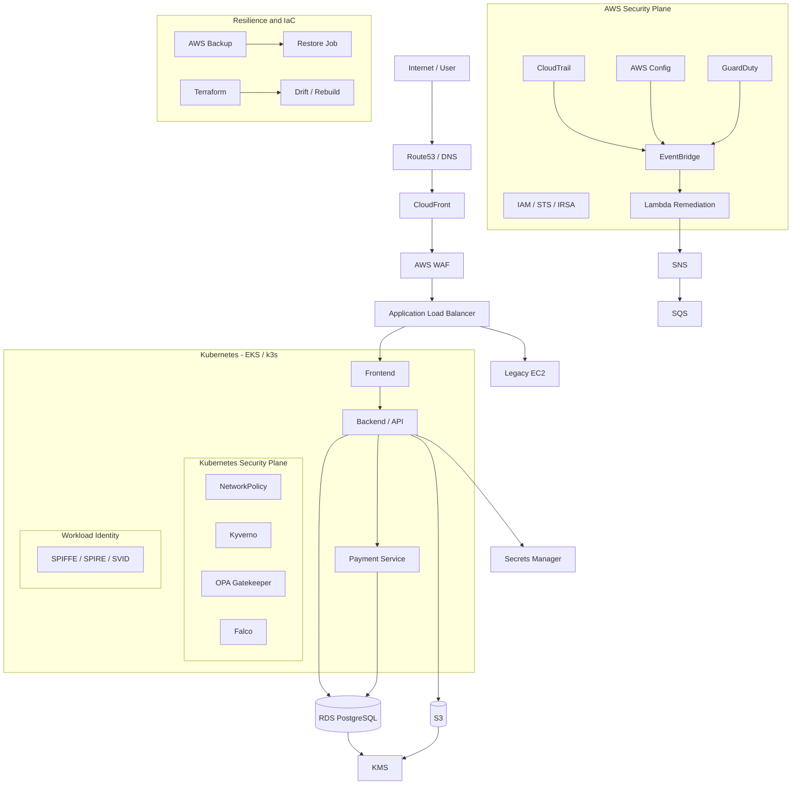
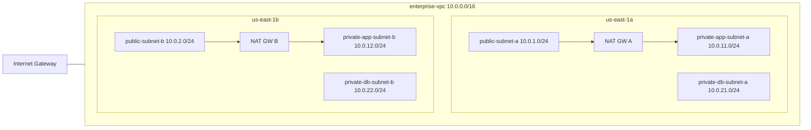
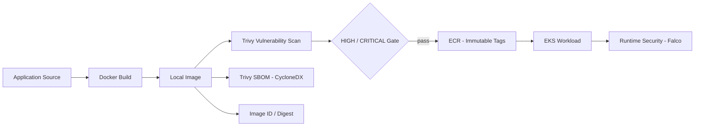
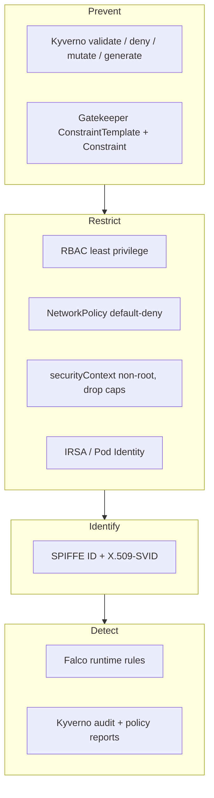
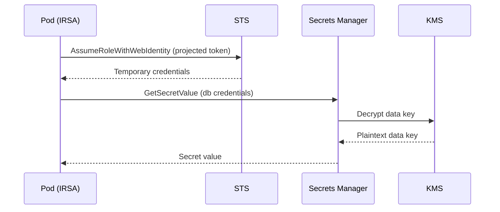
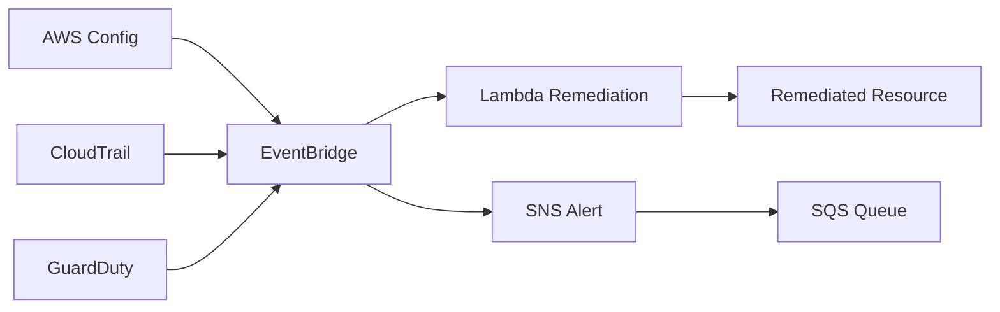
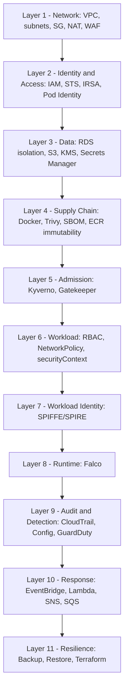

<div align="center">

# Compliance-Based Cloud Security Proof of Concept: AWS & Kubernetes Security Architecture

**A 17-phase, 374-step, evidence-driven security architecture that builds, hardens, monitors, attacks, recovers, and re-validates an AWS + Kubernetes enterprise platform, mapped to OWASP Top 10, PCI DSS, and ISO/IEC 27001 control objectives.**


</div>

---

## Table of Contents

1. [Executive Summary](#1-executive-summary)
2. [Important Disclosure: Emulated Environment](#2-important-disclosure-emulated-environment)
3. [Project Objectives](#3-project-objectives)
4. [Scope and Non-Goals](#4-scope-and-non-goals)
5. [High-Level Architecture](#5-high-level-architecture)
6. [Technology Stack](#6-technology-stack)
7. [Repository Layout](#7-repository-layout)
8. [Prerequisites](#8-prerequisites)
9. [Quick Start](#9-quick-start)
10. [Phase-by-Phase Implementation](#10-phase-by-phase-implementation)
11. [Defense-in-Depth Security Model](#11-defense-in-depth-security-model)
12. [Validation Methodology](#12-validation-methodology)
13. [Final Validation Results](#13-final-validation-results)
14. [Attack Simulation Catalogue](#14-attack-simulation-catalogue)
15. [Known Limitations (Full Register)](#15-known-limitations-full-register)
16. [Compliance Alignment](#16-compliance-alignment)
17. [Evidence Bundle](#17-evidence-bundle)
18. [Differences Between This PoC and Real AWS Production](#18-differences-between-this-poc-and-real-aws-production)
19. [Production Hardening Roadmap](#19-production-hardening-roadmap)
20. [Troubleshooting Guide](#20-troubleshooting-guide)
21. [Reproducibility and Infrastructure as Code](#21-reproducibility-and-infrastructure-as-code)
22. [Glossary](#22-glossary)
23. [FAQ](#23-faq)
24. [Contributing](#24-contributing)
25. [Security Policy](#25-security-policy)
26. [License](#26-license)
27. [Author](#27-author)
28. [Disclaimer](#28-disclaimer)

---

## 1. Executive Summary

This project is a **Compliance-Based Cloud Security Proof of Concept (PoC)** that demonstrates how a layered security architecture can be designed, implemented, validated, attacked, recovered, and re-validated across **AWS-style infrastructure** and **Kubernetes workloads**.

The PoC is organized as **17 sequential phases** and **374 numbered, reproducible steps**. Every phase builds on the previous one, and the final phase (Phase 17) combines every control into a single production-like transaction path and tests whether the whole architecture still holds when the application is **used, attacked, disrupted, restored, and reconciled through IaC**.

### What this PoC proves

| Question | Answer in this PoC |
| --- | --- |
| Can the network be segmented into public, private-app, and private-data tiers? | Yes (Phase 1, Phase 13, Phase 17). |
| Can workloads get AWS access without static credentials? | Yes, via IRSA and projected ServiceAccount tokens (Phase 3, 6, 8, 13). |
| Can secrets and encryption be centralized? | Yes, via KMS and Secrets Manager (Phase 8). |
| Can container images be scanned and described by an SBOM before deployment? | Yes, via Trivy and CycloneDX (Phase 12). |
| Can insecure Kubernetes resources be blocked at admission? | Yes, via Kyverno and OPA Gatekeeper (Phase 14). |
| Can suspicious runtime behavior be detected? | Yes, via Falco (Phase 14). |
| Can workloads have cryptographic identities independent of network location? | Yes, via SPIFFE/SPIRE X.509-SVIDs (Phase 15). |
| Can audit, compliance, and threat detection be automated? | Yes, via CloudTrail, AWS Config, GuardDuty, EventBridge, Lambda (Phase 10, 11). |
| Can the platform be backed up, restored, and rebuilt from code? | Yes, via AWS Backup and Terraform (Phase 16). |
| Does the full chain survive attack simulation and recovery? | Yes, with documented limitations (Phase 17). |

### Headline result

```text
Final Enterprise E2E Validation (Phase 17)
------------------------------------------
PASS                 : 41
FLOCi LIMITATION     : 14
FAIL                 : 0
NOT TESTED           : 0
```

> **Reading this correctly:** `FLOCi LIMITATION` means the *test environment* could not exercise a behavior (for example, a mock backend that has no SQL layer cannot demonstrate SQL injection prevention). It is **not** a vulnerability finding and **not** a pass. Every limitation is itemized in [Section 15](#15-known-limitations-full-register).

---

## 2. Important Disclosure: Emulated Environment

This PoC runs on a **local AWS emulator called Floci**, not on real AWS. EKS "real mode" in Floci is backed by **k3s**.

This has direct consequences for how results must be interpreted:

| Aspect | What happens in this PoC | What it means |
| --- | --- | --- |
| AWS API responses | Served by Floci at `http://localhost:4566` | API behavior is emulated, not AWS-authoritative. |
| Credentials | Static test credentials (`test` / `test`) | IAM authorization is not enforced as in production. |
| EKS | k3s container behind an EKS API abstraction | No AWS VPC CNI, no managed control plane. |
| Node groups | Represented mostly as metadata | Instance profiles are not attached to real nodes. |
| ALB / WAF | Control plane objects are created | Real data-plane forwarding and WAF blocking were **not** verified (WAF returned HTTP 200 in tests). |
| ECR | Repository and metadata APIs work | Registry hostname did not resolve from Docker/EKS, so push/pull failed. |
| OIDC / IRSA | Floci mock OIDC issuer with `AssumeRoleWithWebIdentity` support | Validates claim handling, not real AWS STS trust. |
| "ISSUED" certificate status | Emulator-represented state | Not proof of real ACM DNS validation. |

> **Rule used throughout this repository:** results are classified against **actual emulator behavior**, never against idealized AWS behavior. Where behavior differs, the step documents both the **Expected AWS** result and the **Actual Floci** result.

---

## 3. Project Objectives

1. **Design** a multi-tier AWS network and identity foundation with least privilege.
2. **Deploy** an EKS-based workload platform with private compute, IRSA, and namespace isolation.
3. **Protect** the edge with ALB, WAF, TLS, and DNS.
4. **Secure data** at rest and in transit using RDS isolation, S3 hardening, KMS, and Secrets Manager.
5. **Observe** the platform with CloudWatch, SNS alerting, CloudTrail, AWS Config, and GuardDuty.
6. **Automate response** with EventBridge, Lambda, SNS, and SQS.
7. **Secure the container supply chain** with Docker build, Trivy, SBOM, digest capture, and ECR controls.
8. **Harden Kubernetes** with RBAC, NetworkPolicy, `securityContext`, IRSA, and EKS Pod Identity discovery.
9. **Enforce policy at admission** with Kyverno and OPA Gatekeeper, and **detect runtime threats** with Falco.
10. **Establish workload identity** with SPIFFE/SPIRE and combine it with NetworkPolicy.
11. **Prove resilience and governance** with tagging, AWS Backup, restore jobs, Terraform lifecycle, and drift detection.
12. **Validate everything end to end** under simulated attacks and failure, and map evidence to compliance frameworks.

---

## 4. Scope and Non-Goals

### In scope

- AWS networking, IAM, EKS, ALB, WAF, RDS, S3, Route53, ACM, KMS, Secrets Manager
- CloudWatch, SNS, CloudTrail, AWS Config, GuardDuty, EventBridge, Lambda, SQS
- ECR, Trivy, SBOM, Docker build pipeline
- Kubernetes RBAC, NetworkPolicy, Pod security, IRSA, Pod Identity discovery
- Kyverno, OPA Gatekeeper, Falco
- SPIFFE/SPIRE (X.509-SVID)
- AWS Backup, Resource Tagging, Terraform lifecycle
- Application-layer attack simulation against a mock backend

### Out of scope / non-goals

| Item | Reason |
| --- | --- |
| Claiming PCI DSS compliance | Requires a formal assessment of real scope. |
| Claiming ISO/IEC 27001 certification | Requires an ISMS audit. |
| Real AWS cost, scale, or performance testing | The PoC is local and emulated. |
| Falcosidekick and Falcosidekick UI | Intentionally **removed from Phase 14 scope**. |
| JWT-SVID | Phase 15 focused on X.509-SVID. |
| Full application penetration testing | The target is a mock backend (`http-echo`) with no real business logic. |
| Multi-account / AWS Organizations governance | Single emulated account `000000000000`. |

---

## 5. High-Level Architecture

### 5.1 End-to-end enterprise architecture (Phase 17 target state)



### 5.2 Network topology (Phase 1)



| Tier | AZ-a | AZ-b | Purpose |
| --- | --- | --- | --- |
| Public | `10.0.1.0/24` | `10.0.2.0/24` | ALB, NAT Gateways |
| Private App | `10.0.11.0/24` | `10.0.12.0/24` | EKS worker nodes |
| Private DB | `10.0.21.0/24` | `10.0.22.0/24` | RDS PostgreSQL |

### 5.3 Container supply chain (Phase 12)



### 5.4 Kubernetes control layering (Phase 13 to 15)



---

## 6. Technology Stack

| Layer | Technology | Role in this PoC |
| --- | --- | --- |
| Host OS | Linux (Ubuntu) | Execution environment |
| AWS emulator | **Floci** (API on `localhost:4566`, UI on `localhost:4500`) | Emulates AWS services |
| Kubernetes | EKS API abstraction backed by **k3s** | Workload platform |
| CLI | AWS CLI v2, `kubectl`, `helm`, `docker`, `buildx` | Operation and automation |
| Container security | **Trivy 0.74.0**, CycloneDX SBOM | Vulnerability scanning, SBOM |
| Registry | Amazon ECR (Floci) | Image repository, tag immutability |
| Admission control | **Kyverno**, **OPA Gatekeeper** | Policy as code |
| Runtime security | **Falco** (via Falco Operator) with container plugin and official rules | Syscall-level detection |
| Workload identity | **SPIFFE / SPIRE** (`spire-controller-manager`, `ClusterSPIFFEID`) | X.509-SVID identities |
| IaC | **Terraform** (AWS provider against Floci) | Provision, drift, import, destroy, recreate |
| Backup | AWS Backup | Vault, plan, selection, job, restore |
| Data | RDS PostgreSQL, S3 | Relational and object data |
| Crypto and secrets | KMS, Secrets Manager | Encryption and credential storage |
| Observability | CloudWatch Agent (DaemonSet), CloudWatch Logs/Alarms, SNS | Metrics, logs, alerts |
| Audit and detection | CloudTrail, AWS Config, GuardDuty | Audit trail, compliance, threats |
| Automation | EventBridge, Lambda (Python), SQS, SNS | Automated remediation |
| Frontend tooling | Node.js, `pnpm` (Floci UI) | Local console |

---

## 7. Repository Layout

```text
.
├── Architecture.png
├── Phase 1-11.pdf
├── Phase 12 — Container Supply Chain Security.md
├── Phase 13 — EKS Workload & Identity Security.md
├── Phase 14 — Kubernetes Admission & Runtime Security.md
├── Phase 15 — Workload Identity & Zero Trust.md
├── Phase 16 — Resilience, Governance & IaC Validation.md
├── Phase 17 — End-to-end Enterprise Validation.md
└── README.md
```

---

## 8. Prerequisites

| Requirement | Notes |
| --- | --- |
| Linux (Ubuntu recommended) | Host for Floci, Docker, k3s |
| Floci | Installed and runnable as the `floci` user (`floci start`, `floci status`) |
| Docker + Buildx | Image build and local runtime tests |
| AWS CLI v2 | Always used with `--endpoint-url=http://localhost:4566` |
| `kubectl` | Connected to the Floci-provisioned EKS/k3s cluster |
| Helm | Installs Kyverno, Gatekeeper, Falco Operator, SPIRE |
| Terraform | AWS provider pointed at Floci |
| Trivy (0.74.0 used) | Vulnerability scanning and SBOM generation |
| Node.js + pnpm | Optional, for the Floci UI |
| `jq`, `curl`, `openssl` (host) | Output parsing and TLS inspection |

> **Recommended minimum resources:** a machine able to run Docker, k3s, Floci, Kyverno, Gatekeeper, Falco, and SPIRE concurrently. Size it generously; admission controllers and runtime sensors are memory-hungry.

---

## 9. Quick Start

### 9.1 Start Floci

```bash
su - floci
floci status          # check whether the core service is running
floci start           # start it if needed

# Optional GUI
cd ~/floci-ui
pnpm dev              # open http://localhost:4500
```

### 9.2 Configure the AWS environment

```bash
export AWS_ACCESS_KEY_ID=test
export AWS_SECRET_ACCESS_KEY=test
export AWS_DEFAULT_REGION=us-east-1
export ENDPOINT="http://localhost:4566"
export AWS_ACCOUNT_ID="000000000000"
```

### 9.3 Smoke test

```bash
aws --endpoint-url=$ENDPOINT ec2 describe-vpcs
aws --endpoint-url=$ENDPOINT sts get-caller-identity
kubectl get nodes
```

### 9.4 Execute the phases in order

Phases are **strictly sequential**. Each phase begins by validating the baseline created by the previous phase. Do not skip phases.

```text
Phase 1  -> Phase 2  -> Phase 3  -> ... -> Phase 17
```

> **Tip:** Each phase has a "Prepare Workspace" step and a "Final Validation" step. Run both; the final validation of one phase is the baseline of the next.

---

## 10. Phase-by-Phase Implementation

### Phase summary

| Phase | Title | Steps | Primary Focus |
| --- | --- | --- | --- |
| 1 | Networking Foundation | 2 to 6 | VPC, subnets, IGW, NAT, route tables |
| 2 | Security | 7 to 8 | Security groups, IAM |
| 3 | Compute | 9 to 20 | EKS, private node group, IRSA, namespace, workloads |
| 4 | Traffic Management & Edge Security | 21 to 32 | NodePort, ALB, target groups, WAF |
| 5 | Database | 33 to 39 | Private RDS PostgreSQL, network isolation |
| 6 | Storage & Object Security | 40 to 59 | S3 hardening, versioning, lifecycle, pod-to-S3 via IRSA |
| 7 | Domain & SSL | 60 to 75 | Route53, ACM, HTTPS listener, TLS |
| 8 | Secrets Management & Encryption | 76 to 94 | KMS, Secrets Manager, IRSA-based retrieval |
| 9 | Monitoring & Observability | 95 to 112 | CloudWatch Agent, logs, metrics, alarms, SNS |
| 10 | Audit, Compliance & Threat Detection | 113 to 126 | CloudTrail, AWS Config, GuardDuty |
| 11 | Automated Security Response | 127 to 145 | EventBridge, Lambda, SNS, SQS |
| 12 | Container Supply Chain Security | 146 to 176 | Docker, Trivy, SBOM, ECR |
| 13 | EKS Workload & Identity Security | 177 to 204 | RBAC, NetworkPolicy, securityContext, IRSA, Pod Identity |
| 14 | Kubernetes Admission & Runtime Security | 205 to 246 | Kyverno, Gatekeeper, Falco |
| 15 | Workload Identity & Zero Trust | 247 to 268 | SPIFFE/SPIRE, X.509-SVID |
| 16 | Resilience, Governance & IaC Validation | 269 to 314 | Tagging, Backup, Restore, Terraform |
| 17 | End-to-End Enterprise Validation | 315 to 374 | Capstone: transact, attack, recover, reconcile |

> Step 1 is **Onboarding** (Floci startup and AWS environment variables). Step ranges for the boundaries of Phases 5, 6, 8, 10, and 11 are approximate where the source documents do not show an explicit final-validation step number; verify against your own step log.

---

### Phase 1: Networking Foundation

**Goal:** Build a segmented, multi-AZ network baseline.

| Component | Detail |
| --- | --- |
| VPC | `enterprise-vpc`, `10.0.0.0/16` |
| Subnets | 2 public, 2 private-app, 2 private-db across `us-east-1a` / `us-east-1b` |
| Internet Gateway | `enterprise-igw`, attached to the VPC |
| NAT Gateways | One per AZ (`enterprise-nat-a`, `enterprise-nat-b`) with dedicated Elastic IPs |
| Route tables | Public routes via IGW; private routes via per-AZ NAT |

**Security rationale:** isolating tiers limits blast radius; per-AZ NAT avoids a single egress dependency.

**Validation:** `describe-vpcs`, `describe-subnets`, `describe-internet-gateways`, `describe-nat-gateways`, `describe-route-tables`.

---

### Phase 2: Security Foundation

**Goal:** Establish the identity and network-filtering baseline.

- Security groups scoped per tier (ALB, application, database).
- IAM roles and policies following least privilege.
- Trust relationships prepared for EKS and later IRSA.

**Security rationale:** security groups are the stateful perimeter for each tier; IAM is the authorization root for every later phase.

---

### Phase 3: Compute

**Goal:** Provision a private EKS-based compute platform with workload identity.

| Capability | Detail |
| --- | --- |
| EKS cluster | Created and connected via `kubectl` |
| Node group | Private node group (represented as metadata in Floci) |
| IRSA | OIDC provider and IAM role trusted by a specific ServiceAccount |
| Namespace | `enterprise-app` |
| ServiceAccount | `enterprise-app-sa` bound to the IRSA role |
| Test workload | Deployed and validated for private connectivity |

**Validation highlights:** private workload architecture, internal connectivity, IRSA foundation.

---

### Phase 4: Traffic Management & Edge Security

**Goal:** Expose the application through an internet-facing ALB protected by WAF.

1. Expose the workload via **NodePort**.
2. Create an **ALB target group** and register the EKS worker node.
3. Provision an **internet-facing ALB** and listener.
4. Create a **WAF IP set** and **Web ACL**, then associate it with the ALB.
5. Validate the data plane and WAF enforcement.

> **Emulator note:** ALB external forwarding and WAF blocking could not be verified end to end; Floci returned HTTP `200` where AWS would return `403`. Control-plane objects (IP set, Web ACL, association) were created successfully.

---

### Phase 5: Database

**Goal:** Deploy a private, network-isolated RDS PostgreSQL instance.

- DB subnet group on the private DB subnets.
- Security group allowing database access only from the application tier.
- RDS PostgreSQL instance deployed privately.
- Validation across three layers: **control plane**, **network isolation**, **PostgreSQL data plane**.

---

### Phase 6: Storage & Object Security

**Goal:** Build a hardened S3 baseline and prove pod-to-S3 access using workload identity.

| Control | Detail |
| --- | --- |
| Private bucket | Block-public-access validated |
| Versioning | Enabled and verified |
| Lifecycle | Lifecycle management configured |
| IRSA test pod | Projected ServiceAccount token inspected |
| JWT claims | `iss`, `sub`, `aud` inspected |
| STS | `AssumeRoleWithWebIdentity` validated |
| Identity | Temporary IAM identity confirmed |
| Data plane | Pod-to-S3 list, read, and write; object created by Kubernetes workload |
| Isolation | Workload identity isolation validated |

---

### Phase 7: Domain & SSL

**Goal:** Add DNS and TLS in front of the ALB.

- Route53 hosted zone and alias record to the existing ALB.
- ACM certificate request and inspection, DNS validation record check.
- HTTPS listener creation and validation.
- DNS resolution, HTTPS data plane, and TLS handshake tests.

> **Emulator note:** certificate status `ISSUED` is an emulator-represented state, not proof of real ACM validation.

---

### Phase 8: Secrets Management & Encryption

**Goal:** Remove database credentials from application configuration.



| Step group | What was proven |
| --- | --- |
| KMS key + alias | Key created, aliased, encrypt/decrypt operation verified |
| Secret creation | Database secret stored and metadata validated |
| IAM | Secrets Manager permission added to the IRSA role |
| Pod retrieval | Secret pulled by CLI and by **Python application code** from inside a pod |
| Relationship | KMS and Secrets Manager relationship validated |

---

### Phase 9: Monitoring & Observability

**Goal:** Build metrics, logs, and alerting.

- Amazon CloudWatch Agent deployed as a **DaemonSet** using IRSA.
- Dedicated `monitoring` namespace, IAM policy, and ServiceAccount.
- Validation of EKS workload metrics, RDS metrics, and application log collection.
- CloudWatch alarm connected to an **SNS topic** with a notification subscription.
- Alarm triggered and end-to-end alert path verified.

---

### Phase 10: Audit, Compliance & Threat Detection

**Goal:** Create the audit, configuration-compliance, and threat-detection plane.

| Service | What was configured |
| --- | --- |
| CloudTrail | Trail created, logging started, log delivery validated, event lookup performed |
| AWS Config | Recorder, recording started, delivery channel, security rules, compliance evaluation |
| RDS baseline | Security baseline validated against Config rules |
| GuardDuty | Detector created, finding validation |

---

### Phase 11: Automated Security Response

**Goal:** Turn detections into automated remediation.



- IAM execution role, response resources, and Lambda remediation function.
- Direct Lambda validation, EventBridge rule, event pattern validation, target attachment.
- **Intentional security-control violation** simulated; automated remediation validated.
- Lambda to SNS to SQS chain validated; Config, CloudTrail, and GuardDuty each wired to EventBridge.

---

### Phase 12: Container Supply Chain Security

**Goal:** Prove a secure lifecycle from source code to Kubernetes workload.

| Stage | Control | Status |
| --- | --- | --- |
| Toolchain | Docker, Buildx, `kubectl`, ECR API, Trivy 0.74.0 | PASS |
| Build | Test application and Dockerfile built into an image | PASS |
| Identity | Image ID and digest captured | PASS |
| Scan | Trivy vulnerability scan; HIGH/CRITICAL gate | PASS (local) |
| SBOM | CycloneDX generated and structure validated (`bomFormat`, `specVersion`, `serialNumber`) | PASS |
| ECR repository | Created with **IMMUTABLE** tags | PASS |
| ECR login, push, list, describe, pull | Docker could not resolve the Floci registry hostname | FLOCi LIMITATION |
| ECR native scan / scan-on-push | `StartImageScan` unsupported | FLOCi LIMITATION |
| EKS image pull and runtime | Pod stayed `ImagePullBackOff` | FLOCi LIMITATION |
| Design | Supply-chain lifecycle represented end to end | PASS |

**Failure chain (documented root cause):**

```text
Docker push
   -> 000000000000.dkr.ecr.us-east-1.localhost:5100
   -> DNS resolution fails
   -> ECR push fails
   -> ECR repository stays empty
   -> EKS pull fails
   -> ImagePullBackOff
```

> `ImagePullBackOff` here is **not** an application defect. The root cause is the emulator's registry integration. Phase 13 deliberately avoids ECR as a runtime dependency so this limitation does not contaminate Kubernetes security validation.

---

### Phase 13: EKS Workload & Identity Security

**Goal:** Answer four questions about every workload.

| Question | Control |
| --- | --- |
| What may the workload do to **Kubernetes**? | RBAC |
| What may the workload do to **AWS**? | IRSA / EKS Pod Identity |
| Which workloads may it **talk to**? | NetworkPolicy |
| With which **Linux privileges** may it run? | `securityContext` |

**Implemented controls**

- Dedicated security namespaces with labels
- Dedicated ServiceAccounts; projected-token behavior inspected
- Least-privilege `Role` / `RoleBinding`
- RBAC **positive and negative** paths (allowed list; forbidden pod deletion, secrets, nodes; `ClusterRole` escalation attempt)
- **Default-deny** NetworkPolicy, ingress isolation test, explicit allow (ingress and egress), DNS exception, unauthorized egress test
- Pod hardening: non-root, privilege escalation disabled, capabilities dropped
- IRSA: OIDC provider registration, trust policy inspection, web-identity injection, STS identity, least-privilege AWS access, unauthorized ServiceAccount test
- EKS Pod Identity: capability detection, association, credential injection, API access, **IRSA vs Pod Identity comparison**
- Integration of Namespace + RBAC + NetworkPolicy; cross-namespace isolation

> **Note on results:** The Phase 13 matrix in the source material is an **expected baseline** (`PASS` or `PASS / FLOCi LIMITATION`) captured before the final actual Floci output was recorded. Enforcement of NetworkPolicy, IRSA injection, and Pod Identity depends on the emulator's CNI and credential bridge. Replace the baseline with your actual run output in `evidence/` before publishing.

---

### Phase 14: Kubernetes Admission & Runtime Security

**Goal:** Demonstrate three distinct security mechanisms.

```text
PREVENT            Kyverno / Gatekeeper   "Do not admit workloads that violate policy"
DETECT             Kyverno Audit          "This workload violates policy"
DETECT AT RUNTIME  Falco                  "A running workload is behaving suspiciously"
```

| Component | Capability proven | Status |
| --- | --- | --- |
| Kyverno | Install, CRDs, admission webhooks, `failurePolicy` review | PASS |
| Kyverno validation | Insecure resources rejected | PASS |
| Kyverno allow | Compliant workload admitted | PASS |
| Kyverno deny | Violations blocked | PASS |
| Kyverno audit and reports | Violations detected without blocking; policy reports inspected | PASS |
| Kyverno mutation | Resources automatically modified; **mutation precedes validation** | PASS |
| Kyverno generation | Security resources auto-generated (e.g., default NetworkPolicy) | PASS |
| Gatekeeper | `ConstraintTemplate` (Rego), `Constraint`, positive, negative, audit tests | PASS |
| Kyverno vs Gatekeeper | Real side-by-side comparison | PASS |
| Falco | Operator, instance, runtime engine, container plugin, official rules | PASS |
| Falco detection | Runtime event triggered; **custom rule** created and validated | PASS |
| Regression | Phase 13 controls unaffected; admission bypass attempt; failure-mode and recovery validation | PASS |
| Falcosidekick / UI | Event forwarding and visualization | **OUT OF SCOPE** |

---

### Phase 15: Workload Identity & Zero Trust

**Goal:** Give workloads cryptographic identities independent of IP address or network position.

```text
SPIFFE ID:  spiffe://example.org/ns/<namespace>/sa/<serviceaccount>
Template:   spiffe://{{ .TrustDomain }}/ns/{{ .PodMeta.Namespace }}/sa/{{ .PodSpec.ServiceAccountName }}
```

| Capability | Status |
| --- | --- |
| SPIRE Server (StatefulSet) and Agent (DaemonSet) | PASS |
| Trust domain `example.org` | PASS |
| Node attestation | PASS |
| Workload attestation (ServiceAccount + Namespace) | PASS |
| Registration via controller manager / `ClusterSPIFFEID` | PASS |
| Workload API over Unix Domain Socket | PASS |
| X.509-SVID issuance with SPIFFE URI SAN | PASS |
| Trust bundle | PASS |
| Identity uniqueness (`identity-client` vs `identity-server`) | PASS |
| Unauthorized identity rejection | PASS |
| Short-lived SVID rotation | PASS |
| NetworkPolicy + SPIFFE coexistence | PASS |
| **Network Denied + Identity Valid** (network layer remains independent) | PASS |
| Agent restart, server restart, registration persistence | PASS |
| mTLS handshake observation | FLOCi LIMITATION |
| Correct identity allowed / wrong identity denied | FLOCi LIMITATION |
| Network Allowed + Identity Denied (needs an mTLS-aware app) | FLOCi LIMITATION |
| JWT-SVID and audience enforcement | FLOCi LIMITATION (not enabled) |
| Final end-to-end mTLS authorization | FLOCi LIMITATION |

> **Critical clarification:** the mTLS-related limitations stem mainly from the **test workload image lacking tooling** (for example `openssl`) and from the lack of an mTLS-aware test application. They are **testing/implementation limitations**, not fundamental emulator limits. Closing them requires a purpose-built SPIFFE-aware client and server.

---

### Phase 16: Resilience, Governance & IaC Validation

**Goal:** Prove that the platform can be inventoried, governed, backed up, restored, and rebuilt from code.

| Area | Validated |
| --- | --- |
| Inventory | EC2, VPC, subnets, security groups, S3, RDS, IAM baseline |
| Tagging | Standard defined; create, update, filter, key/value discovery, **missing-tag detection** |
| Backup | Vault, plan, selection, on-demand job, recovery point inspection |
| Restore | `StartRestoreJob` supported and executed |
| Protection | Recovery-point and vault deletion protection |
| Terraform lifecycle | init, validate, plan, apply, state read, update, **drift detection**, import, destroy, recreate, idempotency, state backup |
| Security boundary | Terraform lifecycle does not weaken security controls |
| Regression | Phase 12, 13, 14, 15 controls re-validated |
| Resource Explorer | `UnknownOperationException: Unknown operation: POST /Search`: FLOCi LIMITATION |

---

### Phase 17: End-to-End Enterprise Validation

**Goal:** Prove the architecture holds under real use, attack, disruption, and reconciliation.

```text
User traffic -> Frontend -> Backend/API -> Payment
        -> RDS write/read -> S3 object -> Secrets Manager -> KMS
        -> IRSA -> NetworkPolicy segmentation -> SPIFFE/SPIRE
        -> Monitoring and security telemetry
        -> Attack simulation -> Prevention / detection
        -> Controlled failure -> Recovery
        -> Backup / Restore -> Terraform reconciliation
        -> Regression across Phases 1-16 -> Evidence bundle
```

| Stage | Steps |
| --- | --- |
| Workspace, baseline, security-plane validation | 315 to 317 |
| Application: frontend, backend/API, payment | 318 to 322 |
| Segmentation, database, data model | 323 to 326 |
| Secrets, KMS, S3, IAM/IRSA | 327 to 330 |
| Business transaction and public edge | 331 to 333 |
| Application attack simulation | 334 to 343 |
| Audit, compliance, threat detection, response | 344 to 347 |
| Runtime, admission, lateral movement, privilege abuse | 348 to 355 |
| Identity, monitoring, correlation | 356 to 358 |
| Backup, restore, failure, recovery | 359 to 363 |
| IaC reconciliation and regressions | 364 to 368 |
| Evidence, compliance mapping, final matrix | 369 to 374 |

---

## 11. Defense-in-Depth Security Model



### Lifecycle model

```text
BUILD -> HARDEN -> MONITOR -> DETECT -> RESPOND -> IDENTIFY
      -> BACKUP -> RESTORE -> REBUILD -> ATTACK -> REGRESSION -> FINAL E2E
```

### Control independence principle

No single control is trusted alone. Example proven in Phase 15: a workload with a **valid SPIFFE identity** is still **blocked by NetworkPolicy** when the network rule denies the path. Identity does not bypass network authorization, and network allowance does not imply identity authorization.

### Three questions, three controls

| Question | Control |
| --- | --- |
| "May this pod call the Kubernetes API?" | RBAC |
| "May this pod call AWS?" | IRSA / Pod Identity |
| "May this pod talk to that pod?" | NetworkPolicy (+ SPIFFE identity) |

---

## 12. Validation Methodology

### Result classification

| Label | Meaning |
| --- | --- |
| **PASS** | The control was exercised and produced the expected, evidenced result. |
| **FLOCi LIMITATION** | The emulator or test target cannot exercise the behavior. **Not** a pass and **not** a vulnerability. |
| **OUT OF SCOPE** | Deliberately excluded from the phase. |
| **FAIL** | The control was exercised and did not behave as designed. |
| **NOT TESTED** | No test was executed. |

### Dual-expectation reporting

Where emulator and AWS behavior differ, each step records:

```text
Expected AWS     -> what real AWS would return
Actual Floci     -> what the emulator actually returned
Classification   -> PASS | FLOCi LIMITATION
```

### Evidence principles

1. Every claim maps to a numbered step and captured command output.
2. Positive **and** negative tests are required for access controls (allow and deny).
3. Regression steps re-validate earlier phases after later changes.
4. Limitations are never silently converted into passes.

---

## 13. Final Validation Results

### 13.1 Phase 17 final counters

| Result | Count |
| --- | --- |
| PASS | 41 |
| FLOCi LIMITATION | 14 |
| FAIL | 0 |
| NOT TESTED | 0 |

> Counters reproduce the Phase 17 final validation output. The capability-level matrix (55 rows) in the evidence bundle groups assertions differently from the script counters; reconcile both before external publication.

### 13.2 Capability results (Phase 17)

| Domain | Capability | Result |
| --- | --- | --- |
| Platform | Phase 1 to 16 baseline | PASS |
| Application | Frontend, backend/API, payment deployment | PASS |
| Data | DB connectivity, DB write/read, S3 connectivity, S3 object operations | PASS |
| Secrets and crypto | Secrets Manager integration, KMS integration | PASS |
| Identity | IAM least privilege, IRSA, SPIFFE/SPIRE | PASS |
| Network | NetworkPolicy segmentation, lateral-movement containment | PASS |
| Business flow | Normal traffic, checkout transaction | PASS |
| Edge | WAF inspection path, security headers, TLS/HTTPS | PASS |
| Detection | GuardDuty, Config compliance, Falco | PASS |
| Admission | Kyverno enforcement, Gatekeeper enforcement | PASS |
| Privilege abuse | AWS privilege escalation attempt, IRSA privilege abuse, S3 unauthorized access | PASS |
| Resilience | Backup, restore, Terraform state, security regression after rebuild | PASS |
| Recovery | Application recovery, Kubernetes workload recovery | PASS |
| Response | Detection-to-response chain | PASS |
| Final | Enterprise E2E | PASS |
| Application attack surface | Broken access control, IDOR, auth bypass, SQLi, XSS, command injection, path traversal, SSRF, HTTP method abuse, malicious payload | FLOCi LIMITATION |
| Edge | WAF detection/blocking evidence | FLOCi LIMITATION |
| Observability | CloudTrail logging depth, CloudWatch/AWS metrics aggregation, CloudTrail correlation | FLOCi LIMITATION |
| Authorization | KMS unauthorized decrypt, Secrets Manager unauthorized access | FLOCi LIMITATION |

### 13.3 Per-phase status snapshot

| Phase | Outcome |
| --- | --- |
| 1 to 11 | Control-plane and in-cluster validation complete. ALB data-plane forwarding, WAF blocking, and some ACM/RDS data-plane states are emulator-represented. |
| 12 | Local supply chain PASS. ECR push/pull, native scan, and EKS image pull are limited by the emulator's registry hostname resolution. |
| 13 | Security-foundation controls defined and validated; enforcement-dependent items (NetworkPolicy, IRSA injection, Pod Identity) depend on emulator CNI and credential bridge. |
| 14 | All in-scope Kyverno, Gatekeeper, and Falco items PASS. Falcosidekick out of scope. |
| 15 | SPIRE infrastructure and X.509-SVID lifecycle PASS. mTLS authorization and JWT-SVID not proven. |
| 16 | Backup, restore, tagging, Terraform lifecycle PASS. Resource Explorer search unsupported. |
| 17 | Final E2E PASS with 14 documented limitations and 0 failures. |

---

## 14. Attack Simulation Catalogue

Executed in Phase 17 against the production-like transaction path.

| Step | Simulation | Target | Outcome |
| --- | --- | --- | --- |
| 334 | Broken access control (OWASP A01) | Backend | FLOCi LIMITATION: mock has no user/session model |
| 335 | Authentication bypass (forged token) | Backend | FLOCi LIMITATION: mock performs no token validation |
| 336 | SQL injection | Backend | FLOCi LIMITATION: no SQL execution path |
| 337 | Cross-site scripting | Backend | FLOCi LIMITATION: no HTML reflection path |
| 338 | Command injection | Backend | FLOCi LIMITATION: input never reaches a shell |
| 339 | Path traversal | Backend | FLOCi LIMITATION: no dynamic filesystem access |
| 340 | SSRF (OWASP A10) | Backend | FLOCi LIMITATION: no URL-fetch primitive |
| 341 | HTTP method abuse | Backend | FLOCi LIMITATION: no router-level restriction |
| 342 | Oversized / malformed payload | Backend | FLOCi LIMITATION: static response |
| 343 | WAF SQLi/XSS detection | Edge | FLOCi LIMITATION: no genuine rule inspection evidence |
| 344 to 346 | CloudTrail audit, Config compliance, GuardDuty | AWS plane | CloudTrail limited; Config and GuardDuty PASS |
| 347 | Automated response validation | EventBridge / Lambda | PASS |
| 348 | Falco runtime attack | Runtime | PASS |
| 349 | Kyverno admission attack | Admission | PASS: non-compliant workload rejected |
| 350 | Gatekeeper admission attack | Admission | PASS: violation rejected |
| 351 | Lateral movement | Network | PASS: contained by NetworkPolicy |
| 352 | AWS privilege escalation simulation | IAM | PASS: boundary held for intended workload |
| 353 | S3 unauthorized data access | S3 | PASS |
| 354 | KMS unauthorized decrypt | KMS | FLOCi LIMITATION: ended at `InvalidCiphertextException`, not `AccessDenied` |
| 355 | Secrets unauthorized access | Secrets Manager | FLOCi LIMITATION: unauthorized caller could still retrieve secret |
| 356 to 358 | SPIFFE regression, monitoring, incident correlation | Cross-plane | Mixed; see Section 15 |
| 359 to 363 | Backup after attack, restore, controlled failure, backend recovery, regression | Resilience | PASS |

---

## 15. Known Limitations (Full Register)

> A limitation is a statement about **what the test environment can prove**, not about how secure the design is. Each item lists what real AWS or a real application would do and how to close the gap.

### 15.1 Application mock surface

| # | Limitation | Cause | How to close |
| --- | --- | --- | --- |
| L01 | Broken access control / IDOR cannot be proven | `http-echo` has no users, sessions, or object ownership | Deploy an app with authN/authZ and per-object ownership (e.g., a deliberately vulnerable test app) |
| L02 | Authentication bypass cannot be proven | No JWT/session validation | Add an auth layer and test forged/expired tokens |
| L03 | SQLi cannot be proven | No SQL query path | Connect the backend to RDS with parameterized and unparameterized endpoints |
| L04 | XSS cannot be proven | No HTML rendering or reflection | Add a templating endpoint |
| L05 | Command injection cannot be proven | Input not passed to OS | Add a controlled shell-invoking endpoint in an isolated test pod |
| L06 | Path traversal cannot be proven | No dynamic file access | Add a file-serving endpoint |
| L07 | SSRF cannot be proven | No outbound fetch primitive | Add a URL-fetch endpoint; test IMDS and internal-CIDR egress blocks |
| L08 | HTTP method abuse cannot be proven | Mock accepts all methods | Enforce method allow-lists at ALB/WAF or app router |
| L09 | Malicious payload handling cannot be proven | Static response regardless of payload | Test with a real parser and size limits |
| L10 | WAF blocking cannot be proven | Test path produced no genuine WAF inspection; HTTP 200 returned | Use real AWS WAF or a WAF-capable emulator and managed rule groups |

### 15.2 AWS emulator observability and authorization

| # | Limitation | Cause | How to close |
| --- | --- | --- | --- |
| L11 | CloudTrail event history incomplete | Emulator returns insufficient event history | Validate on real AWS with multi-region trail and log-file validation |
| L12 | CloudWatch aggregation not representative | Metrics are Kubernetes/Falco-centric, not full AWS activity | Real CloudWatch with Container Insights and metric filters |
| L13 | CloudTrail correlation incomplete | Same as L11 | Correlate CloudTrail with GuardDuty/Config events on real AWS |
| L14 | KMS negative authorization not proven | Static credentials bypass granular IAM; test ended in cryptographic error | Test with a role lacking `kms:Decrypt` on real AWS and assert `AccessDeniedException` |
| L15 | Secrets Manager negative authorization not proven | Emulator does not enforce granular IAM denial | Test with an unauthorized role on real AWS and assert `AccessDeniedException` |

> The two authorization limitations (L14, L15) matter most from a security-assurance standpoint. In this PoC, **IAM-denied behavior for KMS and Secrets Manager is unproven**; only the intended-permission (positive) path is demonstrated.

### 15.3 Container and registry

| # | Limitation | Cause |
| --- | --- | --- |
| L16 | ECR login, push, pull, list, describe fail | Registry hostname `*.dkr.ecr.us-east-1.localhost:5100` does not resolve for Docker/EKS |
| L17 | ECR native scan and scan-on-push unavailable | `StartImageScan` unsupported |
| L18 | ECR-to-EKS runtime not proven | Consequence of L16; pods hit `ImagePullBackOff` |

### 15.4 Workload identity

| # | Limitation | Cause |
| --- | --- | --- |
| L19 | mTLS handshake not directly observed | Test image lacks `openssl` and similar tooling |
| L20 | Identity-based allow/deny not proven | No mTLS-aware application |
| L21 | JWT-SVID and audience enforcement not tested | Phase 15 scoped to X.509-SVID |

### 15.5 Infrastructure

| # | Limitation | Cause |
| --- | --- | --- |
| L22 | Resource Explorer search unsupported | `POST /Search` returns `UnknownOperationException` |
| L23 | ALB external forwarding not verified | Emulator data plane |
| L24 | AWS VPC CNI not present | k3s-based EKS; NetworkPolicy enforcement depends on the k3s CNI |
| L25 | Node group and instance profile are metadata | Not attached to real EC2 nodes |
| L26 | Terraform import / recreate compatibility is resource-dependent | Provider and emulator coverage varies |

---

## 16. Compliance Alignment

### 16.1 OWASP Top 10 (2021)

| ID | Category | Project mapping | Status |
| --- | --- | --- | --- |
| A01 | Broken Access Control | Phase 13 RBAC / NetworkPolicy; Phase 17 Step 334 | Platform PASS; application test = LIMITATION |
| A02 | Cryptographic Failures | Phase 8 KMS; Phase 17 KMS validation; Phase 7 TLS | PASS (negative authorization = LIMITATION, Step 354) |
| A03 | Injection | Phase 17 Steps 336 to 339 | LIMITATION (mock backend) |
| A04 | Insecure Design | Threat-led layered architecture, Phases 1 to 17 | PASS |
| A05 | Security Misconfiguration | Kyverno, Gatekeeper, WAF, pod hardening, AWS Config | PASS |
| A06 | Vulnerable and Outdated Components | Phase 12 Trivy and SBOM | PASS |
| A07 | Identification and Authentication Failures | Phase 13 and 15 platform identity | PASS at platform layer; application bypass test = LIMITATION |
| A08 | Software and Data Integrity Failures | SBOM, Terraform, ECR immutability | PASS except ECR registry flow |
| A09 | Security Logging and Monitoring Failures | Falco, Kubernetes telemetry, CloudWatch, CloudTrail | Kubernetes PASS; CloudTrail/CloudWatch depth = LIMITATION |
| A10 | Server-Side Request Forgery | Phase 17 Step 340 | LIMITATION |

### 16.2 PCI DSS (control-relevance mapping, not compliance)

| PCI DSS theme | Project controls | Phases |
| --- | --- | --- |
| Network security controls | VPC segmentation, security groups, NetworkPolicy, WAF | 1 to 4, 13, 17 |
| Protect stored account data | RDS isolation, S3 hardening, KMS, Secrets Manager | 5, 6, 8 |
| Protect data in transit | ACM, HTTPS listener, TLS validation, SPIFFE X.509-SVID | 7, 15, 17 |
| Secure systems and software | Trivy, SBOM, admission policy, pod hardening | 12 to 14 |
| Restrict access by need to know | IAM least privilege, RBAC, IRSA | 2, 8, 13, 17 |
| Identify and authenticate access | IRSA, Pod Identity, SPIFFE/SPIRE | 13, 15 |
| Log and monitor access | CloudWatch, CloudTrail, Config, GuardDuty, Falco | 9 to 11, 14, 17 |
| Test security regularly | Attack simulation, regression suites | 12 to 17 |
| Availability and recovery support | Backup, restore, Terraform rebuild | 16, 17 |

### 16.3 ISO/IEC 27001 (CIA alignment)

| Objective | Controls |
| --- | --- |
| **Confidentiality** | IAM, IRSA, KMS, Secrets Manager, NetworkPolicy, SPIFFE/SPIRE |
| **Integrity** | ECR immutability, SBOM, Kyverno, Gatekeeper, Terraform, audit trails |
| **Availability** | Kubernetes recovery, AWS Backup, restore jobs, Terraform rebuild, workload recovery |

### 16.4 NIST CSF function mapping (indicative)

| Function | Project capabilities |
| --- | --- |
| Identify | Resource inventory, tagging standard, missing-tag detection, SBOM |
| Protect | Network segmentation, IAM/IRSA, encryption, admission control, hardening |
| Detect | CloudTrail, Config, GuardDuty, Falco, Kyverno audit |
| Respond | EventBridge, Lambda remediation, SNS, SQS |
| Recover | AWS Backup, restore jobs, Terraform reconciliation, workload recovery |

---

## 17. Evidence Bundle

Phase 17 generates a final evidence bundle (Steps 369 to 374):

| Artifact | Purpose |
| --- | --- |
| Final validation matrix | Capability-by-capability PASS / LIMITATION result |
| Compliance evidence mapping | Control-to-framework traceability |
| Final attack summary | Outcome of every simulated attack |
| Final security chain | End-to-end prevent, detect, respond narrative |
| Phase regression outputs | Proof earlier phases remain healthy |

**Recommended evidence conventions**

- Store raw command output with timestamps per step.
- Name evidence by step: `evidence/phase-17/step-354-kms-unauthorized-decrypt.txt`.
- Never commit real credentials, tokens, or private keys. Use the emulator's static test credentials only.

---

## 18. Differences Between This PoC and Real AWS Production

| Topic | This PoC (Floci / k3s) | Real AWS |
| --- | --- | --- |
| IAM enforcement | Static test credentials, limited granular denial | Full policy evaluation, SCPs, permission boundaries |
| EKS | k3s behind EKS API | Managed control plane, AWS VPC CNI |
| NetworkPolicy | Depends on k3s CNI | Requires a policy-capable CNI (VPC CNI network policy, Calico, Cilium) |
| ALB / WAF | Control-plane objects | Full L7 forwarding; managed rule groups return `403` |
| ECR | Metadata only; registry flow blocked | Full push/pull, scan-on-push, enhanced scanning |
| CloudTrail | Limited event history | Full management and data events, log validation |
| KMS / Secrets denial | Not reliably enforced | `AccessDeniedException` on missing permission |
| ACM | Emulated status | Real DNS/email validation |
| Cost / scale | None | Real quotas, billing, regional behavior |

---

## 19. Production Hardening Roadmap

### Short term

- [ ] Replace `http-echo` with an application that has authentication, authorization, SQL access, and file/URL handling to close L01 to L10.
- [ ] Build an mTLS-aware SPIFFE client/server pair; enable JWT-SVID with audience checks.
- [ ] Add `openssl` / `curl` / `grpcurl` tooling to a dedicated test image.
- [ ] Reconcile the Phase 17 capability matrix with script counters.
- [ ] Replace the Phase 13 expected baseline with actual run output.

### Medium term

- [ ] Re-run Phases 1 to 17 against **real AWS** in a sandbox account.
- [ ] Add image signing and provenance (Sigstore Cosign, SLSA) and enforce digest and signature verification in Kyverno.
- [ ] Add Pod Security Admission / Pod Security Standards (`restricted`) alongside Kyverno.
- [ ] Forward Falco events to a SIEM (Falcosidekick was intentionally out of scope).
- [ ] Add policy unit tests (Kyverno CLI, `conftest` for Rego) in CI.

### Long term

- [ ] Move to a multi-account landing zone with SCPs and centralized logging.
- [ ] Add continuous compliance (AWS Security Hub, Config conformance packs).
- [ ] Implement GitOps (Argo CD / Flux) with policy gates.
- [ ] Commission a formal gap assessment against PCI DSS and ISO/IEC 27001 before any compliance claim.

---

## 20. Troubleshooting Guide

| Symptom | Likely cause | Resolution |
| --- | --- | --- |
| `Could not connect to the endpoint URL` | Floci not running or missing `--endpoint-url` | `floci status`, `floci start`; always pass `--endpoint-url=$ENDPOINT` |
| AWS CLI asks for credentials | Env vars missing | Re-export the variables in [Section 9.2](#92-configure-the-aws-environment) |
| `ImagePullBackOff` | ECR hostname does not resolve (L16) | Use a public or locally loaded image for runtime tests; see Phase 12 root-cause chain |
| `UnknownOperationException` | Operation not implemented in Floci | Classify as `FLOCi LIMITATION`; document Expected AWS vs Actual Floci |
| NetworkPolicy has no effect | CNI does not enforce policies | Run Step 178 CNI detection; use a policy-capable CNI |
| Pod cannot reach Floci from inside cluster | Default-deny egress | Add egress policy for Floci host/port and DNS to `kube-system` |
| Kyverno blocks everything | `failurePolicy: Fail` with webhook outage | Inspect webhook configuration (Step 211); restore the Kyverno pods |
| Falco operator cannot download plugins/rules | Egress blocked | Allow DNS (53) and HTTPS (443) egress for the `falco-operator` namespace |
| SPIRE agent cannot reach socket | CSI driver unavailable | Use the HostPath agent-socket volume workaround documented in Step 252 |
| `kms decrypt` fails with `InvalidCiphertextException` | CiphertextBlob not base64-decoded to binary | Decode the blob before decrypt (Step 328) |
| Terraform plan shows unexpected drift | Out-of-band change | Expected in Step 297; reconcile via `terraform apply` |

---

## 21. Reproducibility and Infrastructure as Code

Phase 16 proves the platform can be reconstructed and reconciled:

| Capability | Result |
| --- | --- |
| `terraform init`, `validate`, `plan`, `apply` | PASS |
| State read and representation | PASS |
| Update of desired state | PASS |
| Drift detection (change outside Terraform seen via `plan`) | PASS |
| Import of existing resource | PASS / FLOCi LIMITATION |
| Destroy | PASS |
| Recreate | PASS / FLOCi LIMITATION |
| Idempotency | PASS |
| State backup | PASS |
| Security regression after IaC lifecycle | PASS |

```bash
cd terraform
terraform init
terraform validate
terraform plan
terraform apply
terraform plan      # must show "No changes" (idempotency)
```

---

## 22. Glossary

| Term | Definition |
| --- | --- |
| **Floci** | Local AWS emulator used as the cloud substrate |
| **k3s** | Lightweight Kubernetes distribution backing Floci's EKS real mode |
| **IRSA** | IAM Roles for Service Accounts; pods assume IAM roles via OIDC web identity |
| **EKS Pod Identity** | Newer pod-to-IAM mechanism using an agent and EKS Auth API |
| **OIDC provider** | Trust anchor letting IAM validate ServiceAccount tokens |
| **STS** | Security Token Service issuing temporary credentials |
| **SBOM** | Software Bill of Materials; here in CycloneDX format |
| **Digest** | Immutable content hash identifying an image |
| **Admission controller** | Webhook that validates or mutates API requests before persistence |
| **Kyverno** | Kubernetes-native policy engine (validate, mutate, generate) |
| **Gatekeeper** | OPA-based admission controller using Rego |
| **Falco** | Runtime threat detection using syscall events |
| **SPIFFE** | Standard for workload identity naming and documents |
| **SPIRE** | Reference implementation of SPIFFE |
| **SVID** | SPIFFE Verifiable Identity Document (X.509 or JWT) |
| **Trust domain** | Root of SPIFFE identity namespace (`example.org` here) |
| **mTLS** | Mutual TLS; both sides authenticate with certificates |
| **Drift** | Difference between declared IaC state and actual infrastructure |
| **Recovery point** | A restorable backup snapshot in AWS Backup |

---

## 23. FAQ

**Is this production-ready?**
No. It is a proof of concept on an emulator. It demonstrates control design and validation methodology, not production assurance.

**Is this PCI DSS compliant or ISO 27001 certified?**
No. The project is *aligned with* control objectives. Compliance and certification require formal assessment.

**Why are there `FLOCi LIMITATION` results instead of failures?**
Because the emulator or mock target could not exercise the behavior. Marking them `FAIL` would falsely imply the control broke; marking them `PASS` would falsely imply it was proven. A separate label keeps the record honest.

**Does `ImagePullBackOff` mean the application image is broken?**
No. The root cause is registry hostname resolution in the emulator (see Phase 12).

**Why do the KMS and Secrets Manager negative tests matter?**
They are the two places where the PoC cannot show IAM *denying* access. Positive paths are proven; denial must be re-tested on real AWS.

**Why Kyverno and Gatekeeper both?**
To compare policy-as-code approaches with real tests: Kyverno uses Kubernetes-native YAML with mutate and generate; Gatekeeper uses Rego with `ConstraintTemplate` and `Constraint`.

**Why was Falcosidekick removed?**
To keep Phase 14 focused on detection capability. Event forwarding is listed in the roadmap.

**Can I run only one phase?**
Not reliably. Each phase validates the previous baseline.

---

## 24. Contributing

Contributions that improve accuracy, reproducibility, and coverage are welcome.

1. Fork the repository and create a branch: `git checkout -b feature/<short-description>`.
2. Keep the step numbering and **Expected AWS vs Actual Floci** reporting format.
3. Never reclassify a `FLOCi LIMITATION` as `PASS` without new evidence.
4. Include command output as evidence for any new claim.
5. Use compliance wording rules from [Section 16](#16-compliance-alignment).
6. Open a pull request describing the change, the phase, and the evidence.

### Commit message convention

```text
phase-<NN>/step-<NNN>: <imperative summary>
```

---

## 25. Security Policy

- This repository uses **static emulator credentials only** (`test` / `test`). Never commit real AWS keys, tokens, kubeconfigs, or private keys.
- Report suspected vulnerabilities in the project's own code or scripts privately to the maintainer (see [Author](#27-author)) rather than opening a public issue.
- Do not point any script in this repository at a real AWS account without reviewing every command first. Several steps create public-edge resources, IAM roles, and deliberate control violations for testing.

---

## 26. License

License to be defined by the repository owner. Until a license file is added, all rights are reserved by the author.

---

## 27. Author

**Ahya Muhammad Abiyu Salam** (Abiyu Salam)

Cloud and Kubernetes Security Engineering

- GitHub: https://github.com/412biyubiy
- LinkedIn: https://www.linkedin.com/in/ahya-muhammad-abiyu-salam/
- Email: ahya.salam2018@gmail.com

---

## 28. Disclaimer

This project is an **educational and portfolio proof of concept** executed on a local AWS emulator. Results demonstrate control design and validation methodology within that environment. They do not constitute a security audit, penetration test, compliance attestation, or certification. Mentions of OWASP, PCI DSS, ISO/IEC 27001, and NIST are for **control-alignment mapping only**. All product names and trademarks belong to their respective owners.
